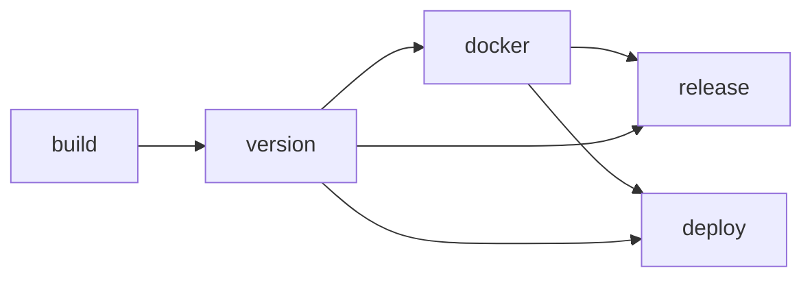

## Overview

The repository defines three GitHub Actions pipelines, one for each deployable service: web, API, and AI service. Each workflow follows the same high-level sequence: build, compute a version, publish a Docker image to GitHub Container Registry, create a GitHub release on `main`, and write a deployment summary. The workflows are intentionally isolated by path filters so changes in one service do not trigger all pipelines.

## Workflow inventory

These workflows are the complete CI/CD surface described in the repository today:

- **`.github/workflows/web.yml`** — `Web CI/CD`
- **`.github/workflows/api.yml`** — `API CI/CD`
- **`.github/workflows/ai-service.yml`** — `AI Service CI/CD`

All three define the same job chain:



The dependency structure is the same in each file:

<CodeGroup tabs="Web,API,AI service">

```yml
version:
  needs: build
docker:
  needs: version
release:
  needs: [version, docker]
deploy:
  needs: [version, docker]
```

```yml
version:
  needs: build
docker:
  needs: version
release:
  needs: [version, docker]
deploy:
  needs: [version, docker]
```

```yml
version:
  needs: build
docker:
  needs: version
release:
  needs: [version, docker]
deploy:
  needs: [version, docker]
```

</CodeGroup>

## Trigger strategy

All three workflows run on `push` and `pull_request` for the `main` and `dev` branches. Each workflow also applies path filters, which keeps runs scoped to the service that changed and, for web and API, shared package changes that can affect those builds.

### Path filters isolate service runs

The web workflow runs when changes touch the web app, shared packages, core workspace files, or the workflow itself.

```yml
paths:
  - "apps/web/**"
  - "packages/**"
  - "pnpm-lock.yaml"
  - "tsconfig.base.json"
  - ".github/workflows/web.yml"
```

The API workflow uses the same shared-file strategy, but points to the API app instead.

```yml
paths:
  - "apps/api/**"
  - "packages/**"
  - "pnpm-lock.yaml"
  - "tsconfig.base.json"
  - ".github/workflows/api.yml"
```

The AI service workflow is narrower. It watches only the AI service directory and its own workflow file.

```yml
paths:
  - "apps/ai-service/**"
  - ".github/workflows/ai-service.yml"
```

### Branch behavior differs between pushes and pull requests

Pull requests trigger the workflows, but the `version` job runs only on push events. That gate matters because `docker`, `release`, and `deploy` all depend on `version`.

```yml
if: github.event_name == 'push'
```

In practice, that means pull requests run the `build` job but do not progress into versioning, image publishing, release creation, or deploy summary steps.

### Concurrency cancels older runs on the same ref

Each workflow defines a per-service concurrency group and sets `cancel-in-progress: true`. A newer push to the same branch cancels the older in-flight run for that service.

- **Web** — `web-${{ github.ref }}`
- **API** — `api-${{ github.ref }}`
- **AI service** — `ai-service-${{ github.ref }}`

## Job flow

The pipelines share a common shape, but the work performed inside `build` differs by service. Versioning, Docker publishing, release creation, and deploy summary behavior are otherwise aligned.

### Build jobs install dependencies and run service-specific checks

The web workflow uses pnpm and Node 20, then typechecks and builds the app.

```yml
- name: Install dependencies
  run: pnpm install --frozen-lockfile

- name: Typecheck
  run: pnpm --filter @repo/web typecheck

- name: Build
  run: pnpm --filter @repo/web build
```

The API workflow uses pnpm, Node 20, and Bun. The active commands install dependencies and build the API.

```yml
- name: Install dependencies
  run: pnpm install --frozen-lockfile

- name: Build
  run: pnpm --filter @repo/api build
```

The AI service workflow sets `apps/ai-service` as the working directory, installs dependencies with `uv`, then runs Ruff format and lint checks.

```yml
- name: Install dependencies
  run: uv sync

- name: Check formatting with Ruff
  run: uv run ruff format --check .

- name: Lint with Ruff
  run: uv run ruff check .
```

### Versioning runs only on pushes

On `main`, each workflow reads a service-specific `VERSION` file, inspects the latest commit message, bumps semantic versioning, writes the new version back to disk, commits the change with `[skip ci]`, and creates a service-prefixed tag.

The bump rules are shared across all three workflows:

```yml
if echo "$COMMIT_MSG" | grep -qiE '\[major\]|BREAKING CHANGE'; then
  MAJOR=$((MAJOR + 1)); MINOR=0; PATCH=0
elif echo "$COMMIT_MSG" | grep -qiE '\[minor\]|feat(\(|:)'; then
  MINOR=$((MINOR + 1)); PATCH=0
else
  PATCH=$((PATCH + 1))
fi
```

On `dev`, the workflows do not persist a new base version. They generate a development version string from the current base version, a timestamp, and a short SHA.

```yml
TIMESTAMP=$(date +%Y%m%d%H%M%S)
VERSION="${BASE_VERSION}-dev.${TIMESTAMP}.${SHORT_SHA}"
```

The environment output also differs by branch:

- **`main`** produces `production`
- **`dev`** produces `development`

### Docker jobs publish images to GitHub Container Registry

All three workflows use `docker/build-push-action@v6` with `push: true`. They build from service-specific contexts, authenticate to `ghcr.io`, and use GitHub Actions cache storage.

Shared tag generation is consistent across services:

```yml
tags: |
  type=raw,value=${{ needs.version.outputs.version }}
  type=raw,value=latest,enable=${{ github.ref == 'refs/heads/main' }}
  type=raw,value=dev-latest,enable=${{ github.ref == 'refs/heads/dev' }}
  type=sha,prefix=
```

Shared cache configuration is also identical:

```yml
cache-from: type=gha
cache-to: type=gha,mode=max
```

### Release and deploy jobs are present in every workflow

The `release` job runs only on `main`. It creates a GitHub release for the computed tag and includes the image reference in the release body.

```yml
if: github.ref == 'refs/heads/main'
```

The `deploy` job exists in all three workflows and sets its GitHub Actions environment from the `version` job output. Its active behavior is to write a summary with the environment, version, and image reference.

```yml
deploy:
  name: Deploy (${{ needs.version.outputs.environment }})
  runs-on: ubuntu-latest
  needs: [version, docker]
  environment: ${{ needs.version.outputs.environment }}
```

<Callout kind="info">

The workflows define a deploy stage, but the repository does not contain active deployment commands. Each deploy job currently writes metadata to the workflow summary and leaves real deployment steps as commented examples.

</Callout>

## Service-by-service comparison

The workflows are structurally similar, but they differ in tooling, path scope, and a few service-specific details.

| Service | Workflow file | Build job behavior | Path scope | Notable difference |
| --- | --- | --- | --- | --- |
| Web | `.github/workflows/web.yml` | Install, typecheck, build | `apps/web/**`, `packages/**`, `pnpm-lock.yaml`, `tsconfig.base.json`, workflow file | Copies `tsconfig.base.json` into Docker context before image build |
| API | `.github/workflows/api.yml` | Install, build | `apps/api/**`, `packages/**`, `pnpm-lock.yaml`, `tsconfig.base.json`, workflow file | Job name says `Build & Lint`, but no explicit lint command appears |
| AI service | `.github/workflows/ai-service.yml` | `uv sync`, Ruff format check, Ruff lint | `apps/ai-service/**`, workflow file | Uses `uv` and Python tooling instead of pnpm-based Node workflow |

### Representative build sections

<CodeGroup tabs="Web,API,AI service">

```yml
- name: Install dependencies
  run: pnpm install --frozen-lockfile

- name: Typecheck
  run: pnpm --filter @repo/web typecheck

- name: Build
  run: pnpm --filter @repo/web build
```

```yml
- name: Install dependencies
  run: pnpm install --frozen-lockfile

- name: Build
  run: pnpm --filter @repo/api build

# Uncomment when tests are added
# - name: Test
#   run: pnpm --filter @repo/api test
```

```yml
- name: Install dependencies
  run: uv sync

- name: Check formatting with Ruff
  run: uv run ruff format --check .

- name: Lint with Ruff
  run: uv run ruff check .

# Uncomment when tests are added
# - name: Run tests
#   run: uv run pytest
```

</CodeGroup>

### Release note scope also differs

Web and API releases include changes from the service directory and `packages/`. The AI service release notes scope only `apps/ai-service/`.

- **Web** — `apps/web/ packages/`
- **API** — `apps/api/ packages/`
- **AI service** — `apps/ai-service/`

## Artifact and registry

Each workflow publishes one container image to GitHub Container Registry under a fixed image name.

- **Web** — `ghcr.io/${{ github.repository_owner }}/gravity-web`
- **API** — `ghcr.io/${{ github.repository_owner }}/gravity-api`
- **AI service** — `ghcr.io/${{ github.repository_owner }}/gravity-ai-service`

The build contexts match each service directory:

- **Web** — `./apps/web`
- **API** — `./apps/api`
- **AI service** — `./apps/ai-service`

Tag patterns are also aligned across services:

- **Version tag** — computed version from the `version` job
- **`latest`** — enabled only on `main`
- **`dev-latest`** — enabled only on `dev`
- **SHA tag** — generated from the commit SHA

Git tags follow a service-prefixed naming convention:

- **Web** — `web-v<version>`
- **API** — `api-v<version>`
- **AI service** — `ai-service-v<version>`

## Limitations

Several parts of the pipelines are placeholders or only partially implemented in the current workflow files.

<Callout kind="alert">

Missing or incomplete checks are explicit in the YAML:

- The web workflow has no test step.
- The API workflow includes a commented test step and no active lint command, despite the `Build & Lint` job name.
- The AI service workflow includes a commented test step.
- Pull requests run the build stage, but the version job is gated to push events.
- Deploy jobs do not execute a real deployment command.

</Callout>

These limitations are visible directly in the workflow definitions and should be read as the current behavior of the repository, not as implied future automation.