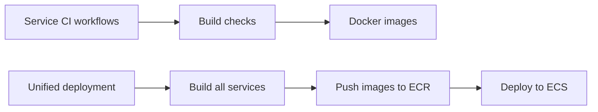

## Overview

The repository defines four GitHub Actions workflows: three service-specific CI workflows for the web, API, and AI service, plus one unified deployment workflow. The service workflows run on pull requests to build and check the affected service and publish its Docker image. The unified deployment workflow builds all three services and deploys them to AWS ECS when code is pushed to `main`, with support for manual deployments.

## Workflow inventory

These workflows are the complete CI/CD surface described in the repository today:

- **`.github/workflows/web.yml`**: `Web CI/CD`
- **`.github/workflows/api.yml`**: `API CI/CD`
- **`.github/workflows/ai-service.yml`**: `AI Service CI/CD`
- **`.github/workflows/deploy-new-account.yml`**: `Unified Deploy (ECS)`. Builds and deploys all three services to AWS ECS when code is pushed to `main`. Also supports manual dispatch.

The three service workflows run build checks and Docker publishing for pull requests. The unified deployment workflow handles production image publishing and ECS deployment.


```mermaid
graph LR
  A[Service CI workflows] --> B[Build checks]
  B --> C[Docker images]
  D[Unified deployment] --> E[Build all services]
  E --> F[Push images to ECR]
  F --> G[Deploy to ECS]
```

The service workflows use service-specific build jobs. The unified deployment workflow coordinates builds, image publishing, task definition registration, and ECS service updates.

<CodeGroup tabs="Web,API,AI service">

```yml
build:
  runs-on: ubuntu-latest
docker:
  needs: build
```

```yml
build:
  runs-on: ubuntu-latest
docker:
  needs: build
```

```yml
build:
  runs-on: ubuntu-latest
docker:
  needs: build
```

</CodeGroup>

## Trigger strategy

The three service workflows run only for pull requests targeting `main`, `dev`, or `nonprod`. They no longer run on pushes, so they do not perform push-based versioning, release creation, or production deployment.

### Path filters isolate service runs

The web workflow runs when changes touch the web app, shared packages, core workspace files, or the workflow itself.

```yml
paths:
  - "apps/web/**"
  - "packages/**"
  - "pnpm-lock.yaml"
  - "tsconfig.base.json"
  - ".github/workflows/web.yml"
```

The API workflow uses the same shared-file strategy, but points to the API app instead.

```yml
paths:
  - "apps/api/**"
  - "packages/**"
  - "pnpm-lock.yaml"
  - "tsconfig.base.json"
  - ".github/workflows/api.yml"
```

The AI service workflow is narrower. It watches only the AI service directory and its own workflow file.

```yml
paths:
  - "apps/ai-service/**"
  - ".github/workflows/ai-service.yml"
```

### Service workflows run only for pull requests

Each service workflow targets the `main`, `dev`, and `nonprod` branches through its pull request trigger.

```yml
on:
  pull_request:
    branches:
      - main
      - dev
      - nonprod
```

Pull requests run the affected service's build checks and Docker workflow. Pushes to these branches do not trigger the service-specific workflows.

### Unified deployment runs on production pushes

The deployment workflow runs when code is pushed to `main`. Its production path targets all three services and deploys them to AWS ECS.

```yml
on:
  push:
    branches:
      - main
```

The workflow also supports manual dispatch. Manual runs allow operators to select the target environment and the services to deploy.

```yml
workflow_dispatch:
  inputs:
    target_env:
      description: Deployment environment
    services:
      description: Services to deploy
```

### Concurrency cancels older runs on the same ref

Each workflow defines a per-service concurrency group and sets `cancel-in-progress: true`. A newer pull request update cancels the older in-flight run for that service.

- **Web**: `web-${{ github.ref }}`
- **API**: `api-${{ github.ref }}`
- **AI service**: `ai-service-${{ github.ref }}`

## Job flow

The service workflows share a common shape, but the work performed inside `build` differs by service. They run build checks and Docker publishing for pull requests. Versioning and GitHub release creation no longer run from these workflows because they do not trigger on pushes.

### Build jobs install dependencies and run service-specific checks

The web workflow uses pnpm and Node 20, then typechecks and builds the app.

```yml
- name: Install dependencies
  run: pnpm install --frozen-lockfile

- name: Typecheck
  run: pnpm --filter @repo/web typecheck

- name: Build
  run: pnpm --filter @repo/web build
```

The API workflow uses pnpm, Node 20, and Bun. The active commands install dependencies and build the API.

```yml
- name: Install dependencies
  run: pnpm install --frozen-lockfile

- name: Build
  run: pnpm --filter @repo/api build
```

The AI service workflow sets `apps/ai-service` as the working directory, installs dependencies with `uv`, then runs Ruff format and lint checks.

```yml
- name: Install dependencies
  run: uv sync

- name: Check formatting with Ruff
  run: uv run ruff format --check .

- name: Lint with Ruff
  run: uv run ruff check .
```

### Unified deployment builds and publishes production images

The unified deployment workflow builds the selected services, pushes their Docker images to Amazon Elastic Container Registry, registers updated ECS task definitions, and updates the corresponding ECS services.

```yml
- name: Build and push image
  run: docker buildx build --push ...

- name: Register ECS task definition
  run: aws ecs register-task-definition ...

- name: Force ECS deployment
  run: aws ecs update-service --force-new-deployment ...
```

The production deployment targets the `gravity-prod` ECS cluster. The workflow uses the computed image references when registering task definitions and updating the services.

### Service workflows no longer version releases

The service workflows are pull-request-only, so their previous push-based versioning logic does not run. They no longer persist service versions, create service-prefixed Git tags, or create GitHub releases.

Production deployment is handled by `deploy-new-account.yml`. That workflow builds and publishes the images needed for the selected deployment instead of relying on version, Docker, release, and deploy jobs from the service-specific workflows.

## Service-by-service comparison

The workflows are structurally similar, but they differ in tooling, path scope, and a few service-specific details.

| Service | Workflow file | Build job behavior | Path scope | Notable difference |
| --- | --- | --- | --- | --- |
| Web | `.github/workflows/web.yml` | Install, typecheck, build | `apps/web/**`, `packages/**`, `pnpm-lock.yaml`, `tsconfig.base.json`, workflow file | Copies `tsconfig.base.json` into Docker context before image build |
| API | `.github/workflows/api.yml` | Install, build | `apps/api/**`, `packages/**`, `pnpm-lock.yaml`, `tsconfig.base.json`, workflow file | Job name says `Build & Lint`, but no explicit lint command appears |
| AI service | `.github/workflows/ai-service.yml` | `uv sync`, Ruff format check, Ruff lint | `apps/ai-service/**`, workflow file | Uses `uv` and Python tooling instead of pnpm-based Node workflow |

### Representative build sections

<CodeGroup tabs="Web,API,AI service">

```yml
- name: Install dependencies
  run: pnpm install --frozen-lockfile

- name: Typecheck
  run: pnpm --filter @repo/web typecheck

- name: Build
  run: pnpm --filter @repo/web build
```

```yml
- name: Install dependencies
  run: pnpm install --frozen-lockfile

- name: Build
  run: pnpm --filter @repo/api build

# Uncomment when tests are added
# - name: Test
#   run: pnpm --filter @repo/api test
```

```yml
- name: Install dependencies
  run: uv sync

- name: Check formatting with Ruff
  run: uv run ruff format --check .

- name: Lint with Ruff
  run: uv run ruff check .

# Uncomment when tests are added
# - name: Run tests
#   run: uv run pytest
```

</CodeGroup>

### Release note scope no longer applies to service workflows

The service workflows no longer create GitHub releases because they run only on pull requests. The unified deployment workflow handles production image publishing and ECS deployment for all three services.

## Artifact and registry

The service workflows build service-specific container images during pull request validation. The unified deployment workflow publishes production images to Amazon Elastic Container Registry before updating ECS.

The service image names remain:

- **Web**: `ghcr.io/${{ github.repository_owner }}/gravity-web`
- **API**: `ghcr.io/${{ github.repository_owner }}/gravity-api`
- **AI service**: `ghcr.io/${{ github.repository_owner }}/gravity-ai-service`

The service build contexts match each service directory:

- **Web**: `./apps/web`
- **API**: `./apps/api`
- **AI service**: `./apps/ai-service`

The service workflows retain aligned tag patterns for pull request image builds:

- **Version tag**: computed version from the service workflow
- **`latest`**: enabled only on `main`
- **`dev-latest`**: enabled only on `dev`
- **SHA tag**: generated from the commit SHA

Production deployment uses the images pushed by the unified deployment workflow to ECR. The deployment workflow then registers ECS task definitions and updates services in the `gravity-prod` cluster.

## Deployment

The unified deployment workflow performs the production deployment when code is pushed to `main`. It can also run through manual dispatch with a selected environment and service set.

The deployment sequence is:

1. Build Docker images for the selected services.
2. Authenticate to Amazon ECR and push the images.
3. Register updated ECS task definitions with the new image references.
4. Update the ECS services in the `gravity-prod` cluster.
5. Call `aws ecs update-service --force-new-deployment` to start the deployment.

<Callout kind="info">

The deployment workflow performs real AWS ECS deployments. It builds images, pushes them to ECR, registers task definitions, and updates ECS services in the `gravity-prod` cluster.

</Callout>

## Limitations

Several parts of the pipelines are still placeholders or only partially implemented in the current workflow files.

<Callout kind="alert">

Missing or incomplete checks are explicit in the YAML:

- The web workflow has no test step.
- The API workflow includes a commented test step and no active lint command, despite the `Build & Lint` job name.
- The AI service workflow includes a commented test step.
- Service workflows run only for pull requests, so versioning and GitHub release creation no longer run from those workflows.
- The deployment workflow uses the `nonprod` GitHub Actions environment even when the deployment target is production.

</Callout>

These limitations are visible directly in the workflow definitions and should be read as the current behavior of the repository. Production deployment is active through the separate unified deployment workflow.