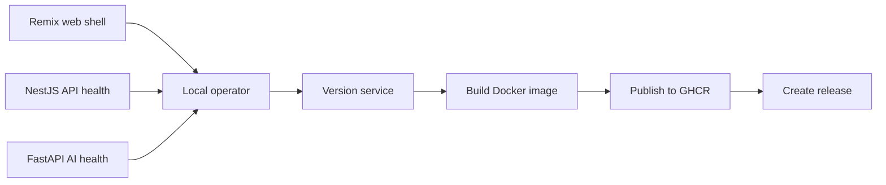

## Overview

Gravity currently provides a polyglot monorepo foundation for running, checking, versioning, packaging, and publishing three service surfaces: a Remix frontend shell, a NestJS API, and a FastAPI AI service.

<Callout kind="info">

Gravity is an implementation scaffold today. The repository does not yet include authentication, persistence, AI inference workflows, or product-specific frontend flows.

</Callout>

## Feature grid

<Columns cols={2}>
  <Card title="Polyglot monorepo" icon="folder" href="/monorepo-architecture">
    Work across separate Remix, NestJS, and FastAPI apps from one repository with shared orchestration through pnpm and Turborepo.
  </Card>
  <Card title="Remix frontend shell" icon="monitor" href="/frontend-application-shell">
    Run the current web shell with implemented routes for `/` and `/home`, both rendering the template welcome experience.
  </Card>
  <Card title="NestJS API health" icon="code" href="/health-checks">
    Verify the API process with `GET http://localhost:3001/health`, which returns `status` and `service` fields.
  </Card>
  <Card title="FastAPI AI service health" icon="cloud" href="/health-checks">
    Verify the AI service process with `GET http://localhost:8001/health`, which returns a static `status` field.
  </Card>
  <Card title="Per-service versioning" icon="settings" href="/service-versioning">
    Manage independent semantic versions for `web`, `api`, and `ai-service` through version files, scripts, tags, and releases.
  </Card>
  <Card title="Packaging and publishing" icon="package" href="/ci-cd-pipelines">
    Build per-service Docker images and publish them to GitHub Container Registry through service-specific GitHub Actions workflows.
  </Card>
</Columns>

## How the pieces fit together

The current system is service-oriented but intentionally narrow. The frontend shell, API health route, and AI service health route can be run and checked independently, while versioning, Docker packaging, and CI/CD workflows provide the release plumbing around each service.

## Recommended workflow

- **Run** the service you are changing with its service-specific command, or use `pnpm dev` when you need the monorepo development loop.
- **Verify** implemented behavior through concrete routes such as `GET /health` on the API and AI service ports.
- **Version** the changed service with the per-service version scripts before release work.
- **Publish** through the matching GitHub Actions workflow, which builds the service image, pushes it to GHCR, tags the release, and creates a GitHub Release on `main`.

<Callout kind="alert">

The CI/CD workflows publish images and releases, but the deploy jobs currently only emit summaries. They do not perform environment-specific infrastructure deployment.

</Callout>

## Related links

<Columns cols={2}>
  <Card title="Quickstart" icon="rocket" href="/quickstart">
    Set up the repository locally and confirm the main services can start.
  </Card>
  <Card title="Architecture overview" icon="book-open" href="/architecture-overview">
    See how the web, API, and AI service boundaries fit together.
  </Card>
  <Card title="Health checks" icon="check-circle" href="/health-checks">
    Verify the currently implemented API and AI service health endpoints.
  </Card>
  <Card title="Docker images and packaging" icon="package" href="/docker-images-and-packaging">
    Review the service-specific Dockerfiles and known packaging caveats.
  </Card>
</Columns>
