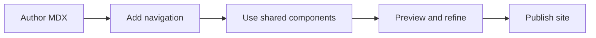

## Overview

This page summarizes the core building blocks for an MDX documentation site and shows how they work together from authoring through publishing.

<Callout kind="info">

Keep pages small and focused so each document answers one reader need well.

</Callout>

## Feature grid

<Columns cols={2}>
  <Card title="MDX page authoring" icon="code" href="/help-center">
    Write documentation pages in MDX so content, structure, and components live in one file.
  </Card>
  <Card title="Navigation-driven IA" icon="folder" href="/help-center">
    Organize pages through navigation so readers can find the right topic without hunting across the site.
  </Card>
  <Card title="Reusable MDX components" icon="settings" href="/help-center">
    Use shared components to present callouts, cards, layouts, and structured content consistently.
  </Card>
  <Card title="Integration hooks" icon="plug" href="/help-center">
    Connect documentation to external tooling, publishing workflows, and site-level behavior where needed.
  </Card>
  <Card title="Help center organization" icon="help-circle" href="/help-center">
    Group task-based articles so support content stays easy to scan and maintain.
  </Card>
  <Card title="Release notes" icon="book-open" href="/help-center">
    Record changes in a focused format so readers can quickly see what changed and whether they need to act.
  </Card>
</Columns>

## How the pieces fit together

Author a page in MDX, wire it into navigation, and use reusable components to make the content clear and scannable. Integration hooks extend the site where needed, while the help center and release notes keep operational content organized around reader tasks and change history.

## Recommended workflow

- **Author** the page in MDX with one clear topic and a structure that matches the reader's task.
- **Preview** the page to confirm links, components, and navigation placement.
- **Publish** once the page is concise, accurate, and easy to scan.

## Related links

<Columns cols={2}>
  <Card title="Help Center" icon="help-circle" href="/help-center">
    Find task-oriented articles for setup, troubleshooting, and maintenance.
  </Card>
  <Card title="Help articles" icon="book-open" href="/help-center">
    Browse focused guidance for common documentation workflows.
  </Card>
</Columns>