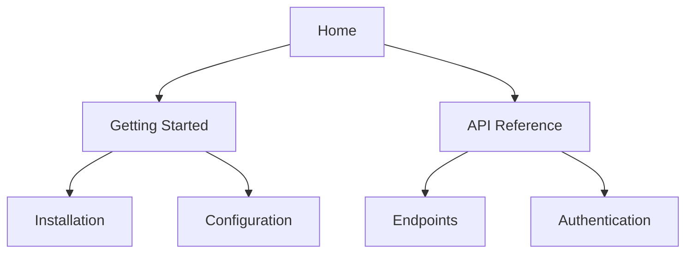

## Overview

Gravity equips you with essential tools to streamline documentation workflows. You can structure complex document hierarchies, collaborate seamlessly with teams, track changes through version history, and find content quickly with advanced search. These features work together to make your documentation scalable and user-friendly.

<Columns cols={2}>
  <Card title="Document Hierarchies" icon="layout" href="#document-hierarchies">
    Organize content with nested pages and intuitive navigation.
  </Card>
  <Card title="Collaboration" icon="users" href="#collaboration">
    Share and edit docs in real-time with your team.
  </Card>
  <Card title="Version History" icon="git-branch" href="#version-history">
    Track every change and revert when needed.
  </Card>
  <Card title="Search" icon="search" href="#search">
    Find exactly what you need across your entire docs site.
  </Card>
</Columns>

## Document Structuring and Hierarchies

Build flexible document structures using folders, pages, and subpages. Gravity supports unlimited nesting, so you create intuitive navigation for users.



<Steps>
  <Step title="Create a Folder" icon="folder">
    Navigate to your workspace and click the `New Folder` button. Name it to reflect its purpose, such as `API Reference`.
  </Step>
  <Step title="Add Pages" icon="file-text">
    Inside the folder, create new pages. Drag and drop to reorder or nest further.
  </Step>
  <Step title="Publish Hierarchy" icon="globe">
    Preview your navigation sidebar to ensure the structure flows logically.
  </Step>
</Steps>

<Callout kind="tip">
  Use clear, descriptive names for folders and pages to improve discoverability.
</Callout>

## Collaboration and Sharing

Invite team members to collaborate on documentation. Assign roles like editor or viewer, and share public links for external access.

<Tabs>
  <Tab title="Team Invite" icon="mail">
    Go to `Settings > Team` and enter email addresses. New members receive an invite link.
  </Tab>
  <Tab title="Public Sharing" icon="share-2">
    Select a page or folder, then generate a shareable URL. Set permissions to read-only or editable.
  </Tab>
  <Tab title="Real-time Edits" icon="edit-3">
    Multiple users edit simultaneously with live cursors and conflict resolution.
  </Tab>
</Tabs>

## Version History Tracking

Every edit creates a new version, allowing you to review changes, compare diffs, and restore previous states.

<CodeGroup tabs="CLI,Web UI">
  ```bash
  # View history via CLI
  gravity history --doc-id=doc_12345 --limit=10
  ```
  ```javascript
  // Fetch history programmatically
  const history = await gravity.docs.getHistory('doc_12345');
  console.log(history.entries);
  ```
</CodeGroup>

<Expandable title="Advanced Version Controls" default-open="false">
  Schedule automatic backups or integrate with Git for deeper version management. Use labels to tag releases like `v1.0` or `draft`.
</Expandable>

## Search Functionality

Gravity's search indexes all content, including titles, body text, and metadata. You get instant results with previews and filters.

| Feature | Description |
|---------|-------------|
| Full-text Search | Matches keywords across pages |
| Filters | By folder, tag, or date |
| Synonyms | Handles common variations like "install" vs "setup" |

<Callout kind="success">
  Pro tip: Add custom metadata tags to pages for precise filtering in searches.
</Callout>

## Next Steps

Explore these features hands-on:

<Columns cols={3}>
  <Card title="Quickstart" icon="zap" href="/quickstart">
    Set up your first doc site.
  </Card>
  <Card title="Advanced Workflows" icon="settings" href="/configuration">
    Customize your setup.
  </Card>
  <Card title="API Integration" icon="code" href="/authentication">
    Connect programmatically.
  </Card>
</Columns>