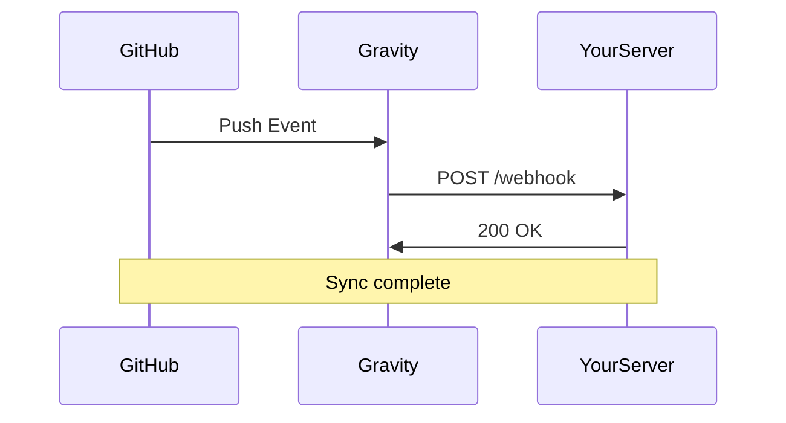

## Overview

Gravity supports seamless integrations with popular third-party tools, allowing you to automate documentation workflows, sync content, and extend functionality. Connect to version control systems, communication apps, and CI/CD pipelines to keep your docs up-to-date automatically.

Use webhooks for real-time updates, import/export data in multiple formats, or leverage the API for custom integrations.

<Columns cols={3}>
  <Card title="GitHub" icon="github" href="https://github.com">
    Sync repositories with your docs.
  </Card>
  <Card title="Slack" icon="message-circle" href="https://slack.com">
    Get notifications for doc changes.
  </Card>
  <Card title="Zapier" icon="zap" href="https://zapier.com">
    Automate workflows across 5000+ apps.
  </Card>
</Columns>

## Third-party App Connections

Set up connections via the Gravity dashboard at `https://dashboard.example.com/integrations`.

<Tabs>
  <Tab title="GitHub" icon="github">
    Authorize Gravity to access your repositories.

    <Steps>
      <Step title="Create App" icon="settings">
        Go to GitHub Settings > Developer settings > GitHub Apps.
      </Step>
      <Step title="Configure Permissions">
        Grant `contents:read` and `pull_requests:write`.
      </Step>
      <Step title="Paste Webhook URL">
        Use `https://api.example.com/v1/webhooks/github`.
      </Step>
    </Steps>
  </Tab>
  <Tab title="Slack" icon="message-circle">
    Install the Gravity Slack app.

    ```bash
    /invite @GravityBot
    ```

    Configure channels for notifications.
  </Tab>
</Tabs>

<Callout kind="tip">
  Test connections in the dashboard before enabling production workflows.
</Callout>

## Import and Export Formats

Gravity supports Markdown, HTML, and JSON for imports/exports.

<CodeGroup tabs="Import,Export">
  ```bash
  curl -X POST https://api.example.com/v1/import \
    -H "Authorization: Bearer YOUR_API_KEY" \
    -F "file=@docs.md"
  ```
  ```bash
  curl -X GET https://api.example.com/v1/export/docs.md \
    -H "Authorization: Bearer YOUR_API_KEY" \
    -o exported-docs.md
  ```
</CodeGroup>

## Webhook Configurations

Configure webhooks to trigger actions on events like doc updates.



<Steps>
  <Step title="Generate Webhook URL">
    In dashboard: Integrations > Webhooks > Create.
  </Step>
  <Step title="Add Secret">
    Use `YOUR_WEBHOOK_SECRET` for signature verification.
  </Step>
  <Step title="Subscribe to Events">
    Select `doc.updated`, `doc.published`.
  </Step>
</Steps>

<ParamField header="X-Grav-Signature" param-type="string" required="true">
  HMAC SHA256 signature.
</ParamField>

## API Usage Basics

Integrate programmatically with Gravity's REST API.

<Request tabs="cURL,JavaScript">
  ```bash
  curl -X POST https://api.example.com/v1/docs \
    -H "Authorization: Bearer YOUR_API_KEY" \
    -H "Content-Type: application/json" \
    -d '{"title": "New Doc", "content": "Hello World"}'
  ```
  ```javascript
  const response = await fetch('https://api.example.com/v1/docs', {
    method: 'POST',
    headers: {
      'Authorization': 'Bearer YOUR_API_KEY',
      'Content-Type': 'application/json'
    },
    body: JSON.stringify({
      title: 'New Doc',
      content: 'Hello World'
    })
  });
  ```
</Request>

<Response tabs="201,401">
```json
{
  "id": "doc_123",
  "title": "New Doc",
  "status": "published"
}
```
```json
{
  "error": "Unauthorized",
  "message": "Invalid API key"
}
```
</Response>

<ResponseField name="id" field-type="string" required="true">
  Unique document identifier.
</ResponseField>

<Expandable title="Advanced Payload Options">
  Customize with `tags={["internal"]}` and metadata.
</Expandable>

For more, see [Quickstart](/quickstart) or [Authentication](/authentication).